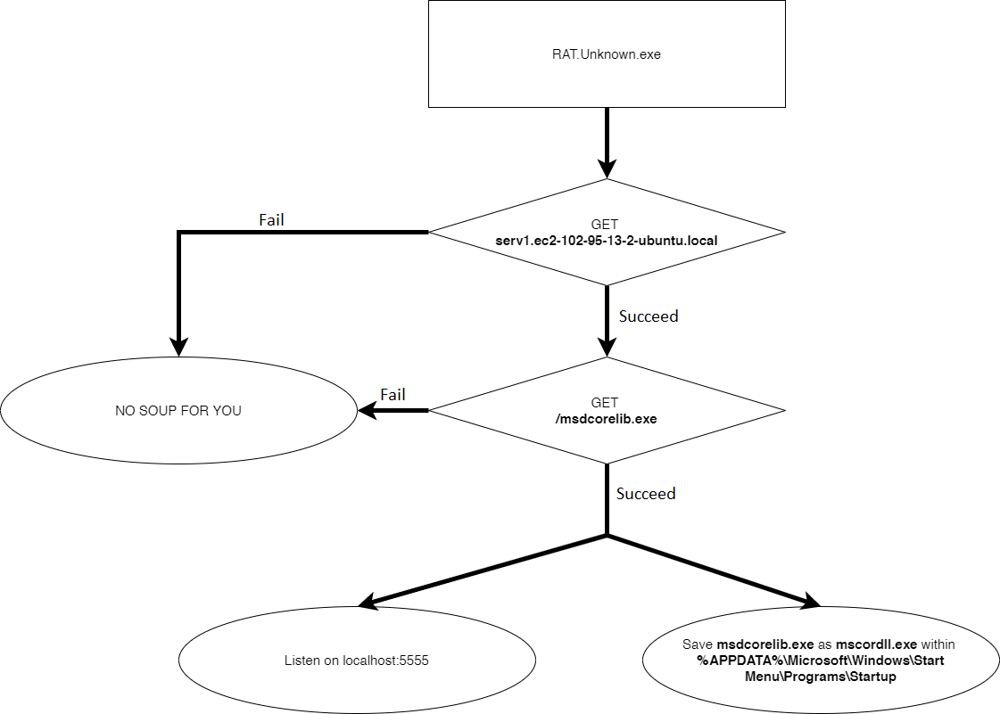
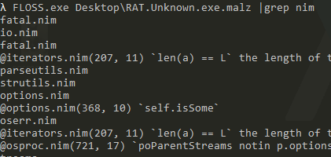
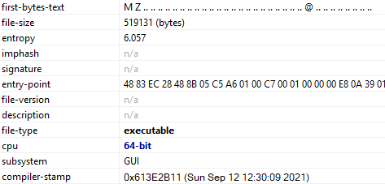
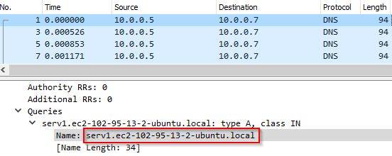
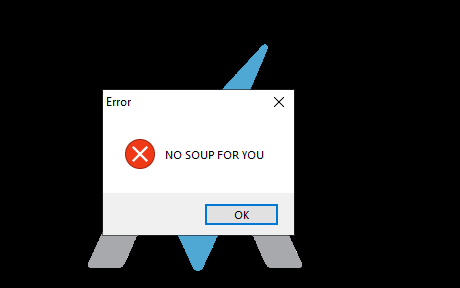

# RAT.Unknown.exe

## Table of contents
  * [Executive summary](#executive-summary)
  * [High-Level Technical Summary](#high-level-technical-summary)
      * [Diagram](#diagram)
  * [Malware Composition](#malware-composition)
  * [Basic Static Analysis](#basic-static-analysis)
      * [strings/FLOSS](#stringsfloss)
      * [PEstudio](#pestudio)
  * [Basic Dynamic Analysis](#basic-dynamic-analysis)
      * [Without network connectivity](#without-network-connectivity)
      * [With network connectivity](#with-network-connectivity)
  * [Indicators of compromise](#indicators-of-compromise)
      * [Network-based](#network-based)
      * [Host-based](#host-based)


## Executive summary
|SHA256 hash | 248d491f89a10ec3289ec4ca448b19384464329c442bac395f680c4f3a345c8c|
|------------|-----------------------------------------------------------------|

RAT.Unknown.exe is a Remote Access Trojan listener malware compiled on September 12th 2021 that runs on port __5555__ with a persistence mechanism. It was written in __nim__ for __x64__ environment. After first detonation, it is going to download a payload from the EC2 instance server at __serv1.ec2-102-95-13-2-ubuntu.local__ and save it to Windows startup location (__%APPDATA%\Microsoft\Windows\Start Menu\Programs\Startup__) as __mscordll.exe__, allowing the payload to execute every time the Windows startup.


## High-Level Technical Summary
The malware contains two part: __RAT.unknown.exe__ and its' persistence __mscordll.exe__. __RAT.unknown.exe__ will first try to make a callback to its server at __serv1.ec2-102-95-13-2-ubuntu.local__ and attempts to download the __msdcorelib.exe__ file, if the action result in a successful connection, it will open a __TCP listener__ on __port 5555__ and download targeted file to Windows startup location as __mscordll.exe__. <br>

However, I could not found the __mscordll.exe__ from the server, so I assume it is the same listener as __RAT.unknown.exe__ and is installed as a persistence mechanism for the malware since it is downloaded to Windows startup location.<br>

If the malware could not make the connection to target server, it is going to escape and print out the error message of __"NO SOUP FOR YOU"__<br><br>

#### Diagram:




## Malware Composition
The malware contains 2 parts: __RAT.Unknown.exe__ for inital foothold on the system and __mscordll.exe__ that is downloaded from server<br>

|File Name      | SHA256 hash                                                     |
|---------------|-----------------------------------------------------------------|
|RAT.Unknown.exe| 248d491f89a10ec3289ec4ca448b19384464329c442bac395f680c4f3a345c8c|
|mscordll.exe   |  Unknown                                                        |


 + `RAT.Unknown.exe`: The initial executable that will reach out to the URL of __serv1.ec2-102-95-13-2-ubuntu.local__ to retrieve __mscordll.exe__ and at the same time, open a __TCP listener__ on __port 5555__
 + `mscordll.exe`: Downloaded from the website, is stored within Windows startup location as a persistence mechanism


## Basic Static Analysis
#### strings/FLOSS:
Lines indicate a prompt that ask user for command inputs -> Command execution capability<br>


Execution files' name along with Windows startup location -> Persistence capability<br>


Suspicious URL callback to a remote EC2 instance<br>


Lots of nim library calls -> Written in nim<br>


#### PEstudio
Start with "MZ" -> Portable Executable<br>
Written for __x64 cpu__ architecture and compiled on __September 12th 2021__<br>



## Basic Dynamic Analysis
#### Without network connectivity
The malware will attempts to make a DNS query and connect to the URL of __serv1.ec2-102-95-13-2-ubuntu.local__. Since there is no outbound internet connectivity this process will fail. Below is the Wireshark capture on the localhost machine<br>


After the fail connection to the callback URL, the malware displays the error message of __"NO SOUP FOR YOU"__ and escape<br>


#### With network connectivity
Like above, the malware tries to make a callback to the URL and succeed. Here is the Wireshark capture on the inetsim server indicate a successful query<br>


Now, it will retrieve the __msdcorelib.exe__ file from the server using __port 80__, if the file does not exist on the server the malware will also display the error message and escape. In case it successfully retrieve the file, __msdcorelib.exe__ will be saved as __mscordll.exe__ in the __%APPDATA%\Microsoft\Windows\Start Menu\Programs\Startup__ directory<br>


File created successfully message within __procmon__<nr>


Within TCPview there is also a listener process that was created by RAT.Unknown.exe to bind to __port 5555__ of the __localhost__<br>


If a connection is made toward the infected machine on port 5555, a base64 encoded message will be displayed. This can be decoded into __"[+] what command can I run for you"__<br>


This prompt is going to accept user inputs, execute the command on infected machine. Then base64 encode the result to send to any machine that successfully made a connection to port 5555<br>


## Indicators of compromise
#### Network-based
Attempts to connect to __serv1.ec2-102-95-13-2-ubuntu.local__  on port 80 to get __msdcorelib.exe__ file<br>


TCP listener on __localhost:5555__<br>


#### Host-based
__mscordll.exe__ within Windows startup directory (__%APPDATA%\Microsoft\Windows\Start Menu\Programs\Startup__)<br>

 
 
## YARA Rules
```Rules
rule RAT_listener{
    meta:
        last_updated = "2021-11-09"
        author = "Khanh"
        description = "Yara rule for PMAT RAT.Unknown.exe sample"

    strings:
        $sus_url1 = "serv1.ec2-102-95-13-2-ubuntu.local"
        $sus_string = "NO SOUP FOR YOU"
        $magic_header = "MZ"
        $file_name1 = "msdcorelib.exe"
        $file_name2 = "mscordll.exe"
        $startup_path = "AppData\\Roaming\\Microsoft\\Windows\\Start Menu\\Programs\\Startup"

    condition:
        $sus_url1 and
        $sus_string and 
        $magic_header at 0 and
        ($file_name1 or $file_name2 or $startup_path)
}
```
